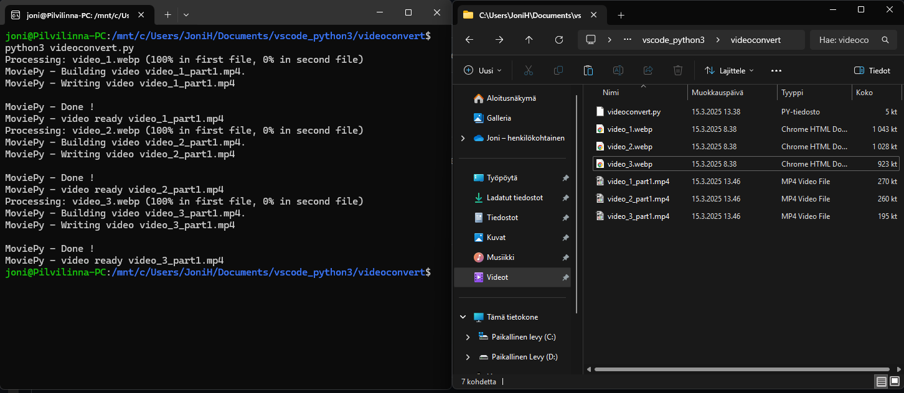
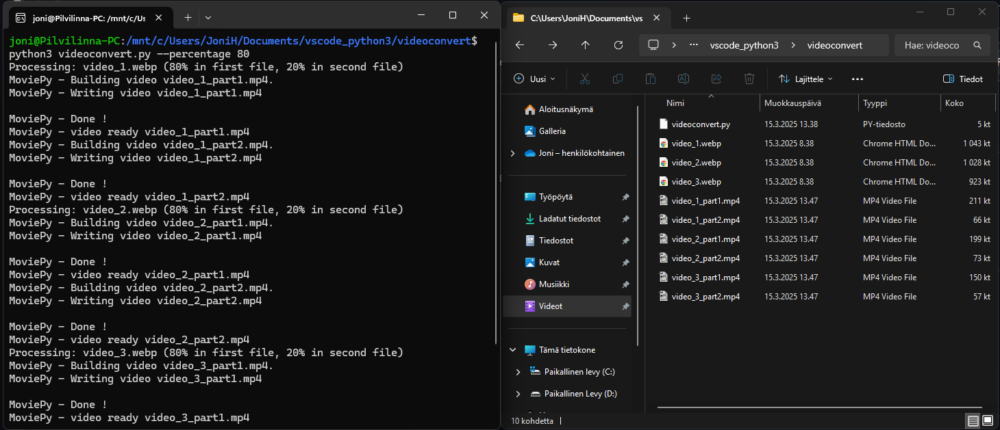
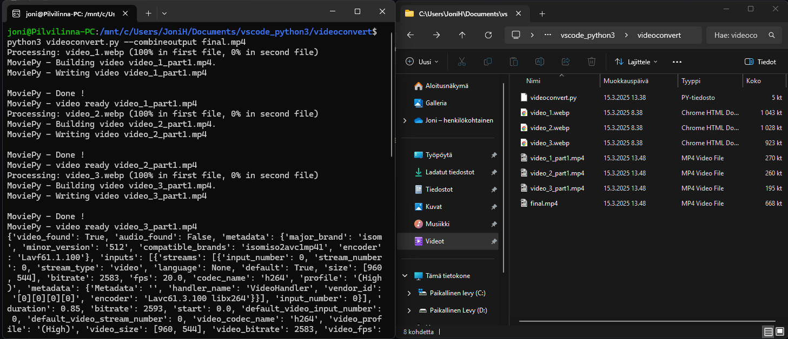

# webptomp4
**Webp to mp4 video converter**
Didint find any good webp to mp4 offline converter so i made simple one with Python3. Tested with WSL ubuntu 22.04.5LTS.
# Requirement:
Any OS that supports python3
1. Python3
2. Python3 Pillow
3. Python3 Moviepy
4. Python3 Pillow
5. Python3 Argparse
6. Python3 Glob2
# Install for Ubuntu
`sudo apt-get update`\
`sudo apt-get install python3`\
`pip3 install moviepy pillow argparse glob2`
# Usage:
Copy videoconvert.py in same folder as video files.
### Convert all webp files in same folder (no user inputs)
Run code: `python3 videoconvert.py`\
\

### Convert percentage parts of video into 2 videos
Run code: `python3 videoconvert.py --percentage 80`\
\

### Convert all videos and extra video file that combined all videos
Run code: `python3 videoconvert.py --combineoutput final.mp4`\
\

